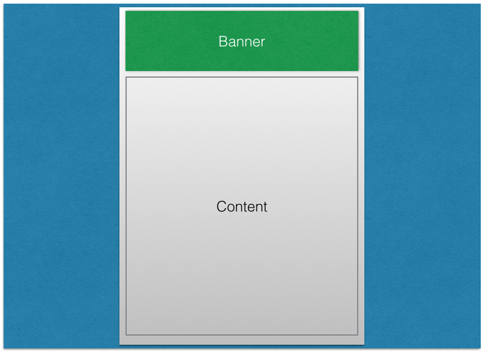
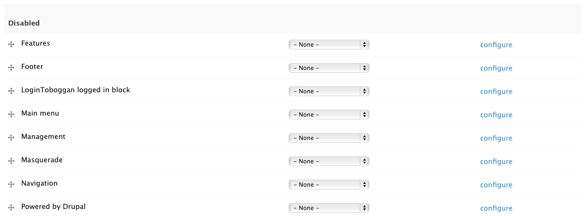
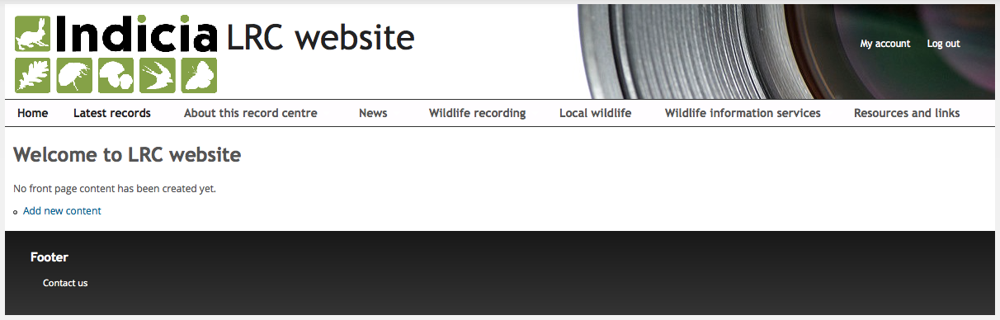

Drupal Blocks
=============

Time for some concepts...

A Drupal theme defines the structure of your pages, such as the page size, banner, column
layouts etc. But, the theme has no responsibility for site functionality or content, which 
is why you can swap a theme on the site and the only thing that changes is the layout and
appearance, not the functionality or content. Therefore the theme must also define 
**regions**, places on the page where content and functionality can do their stuff. At the 
most basic level, you might have a theme which defined a page with a banner and a single
content region as in the following wireframe:

  
Of course, a real Drupal theme will be somewhat more complex, with multiple regions on the
page such as left and right columns and footer areas and possible multiple layout options
as our theme does. But the principle is the same. 

So, what goes into a theme's regions? That's where blocks come in, they are quite 
literally the building blocks of the page which are laid out on the page by placing them 
into the theme's regions. In fact, the reason why when you look at any page on your site
you see the page's content appear is because Drupal defines a core block called **Main
page content** and by default, our theme places it in a region called **Main content**.

The purpose of all this was to add our footer menu to the page, so click the **Structure**
link in the **admin toolbar** then select the **Blocks** link. This shows a page listing
the regions available in your theme and the blocks active in each region. Scroll to the 
bottom where you will find the **Disabled blocks** section and within it, the **Footer**
block:

  
In the **Region** column of the **Footer** block, choose **Footer** in the drop down
then click the **Save blocks** button at the bottom of your page. Visit your site's home
page to check that it has worked.

  
Well, it's worked, but in my opinion it doesn't look very nice. The footer area is a bit 
too dominant and the "Footer" block title is unnecessary. Follow these steps to tidy 
things up:

#. Hover the mouse near the right of the footer area and you will see a settings "cog"
   icon appear, indicating that there is a settings menu you can access for this part of 
   the page. 

  .. image:: ../images/drupal-blocks-menu-footer.png
    :width: 800px
    
#. Select the **Configure block** item in the menu. This is a shortcut to the 
   configuration page for this block, which you could also have reached via the 
   **Structure** - **Blocks** page. 
#. In the **Block title** box, enter ``<none>`` (including the less than and greater than
   symbols) and click the **Save block** button.
#. Now let's lighten up the footer colour a bit in keeping with the rest of the template.
   Select **Appearance** then click **Settings** for **Indicia default theme**. Scroll 
   down to the **Colour scheme** section and change the **Footer top** and **Footer
   bottom** colours to 2 shades of light grey. Since the font won't show very well now, 
   change the **Footer text** to a dark colour then click **Save configuration** and 
   revisit the home page to check that it has worked OK. You could of course continue
   to enhance the footer area by adding other blocks, or using custom CSS to centre the 
   menu etc. 
   
   .. image:: ../images/drupal-blocks-menu-footer-2.png
    :width: 800px
    
Feel free to experiment!