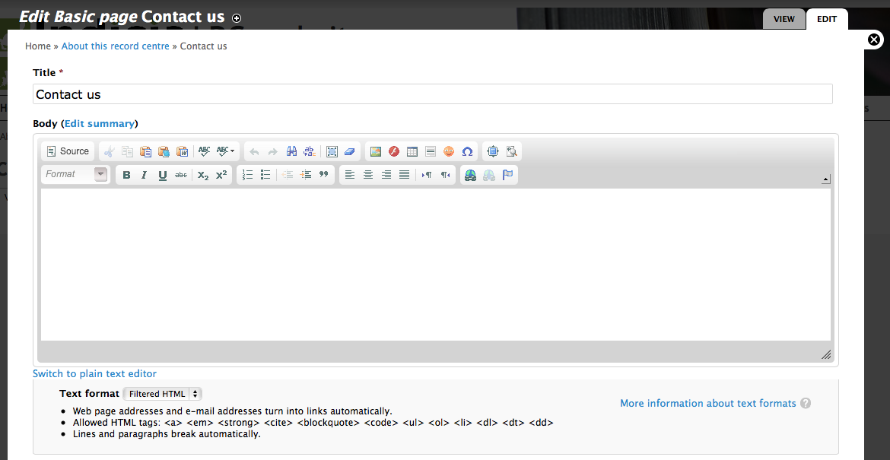

Editing content
===============

The **LRC Drupal Template** site has a menu structure prepared for you, with several blank
pages for you to fill in. We'll start by filling in the **Contact us** page from the 
**About this record centre** menu. The good news is Drupal has built in content editing
features and, even better, the **LRC Drupal Template** already has modules installed to 
make text editing and formatting even easier. 

Select **About this record centre** then **Contact us** from the main site menu. This 
takes you to the blank page provided by the template. Because we are logged in with 
content editing rights, there is a set of tabs at the top of the page with **View** and
**Edit** options - these tabs are not shown on the page at all for users who cannot edit 
the page. Click the **Edit** tab to access the page editing facilities.

This is the standard Drupal page for editing content. Because we are editing a **page**
(there are other content types), the main things we need to specify are the **title** and
**body**. Try filling in some body text and experimenting with the formatting toolbar to 
see how it works. 

At the bottom of the page, there are a number of sections for different aspects of the 
page. Some key ones to know about are:

* **Menu settings** allows you to add or remove a menu link to a page and to choose 
  where in the menu system it will appear. 
* **URL path settings** allows you to control the path your page is accessed at. Every 
  piece of content in a Drupal site is known internally as a **node** and is given a 
  unique ID. Therefore by default your page might have a path such as 
  ``http://www.example.com/node/15`` or ``http://www.example.com/?q=node/15`` if clean 
  URLs are disabled. In this section you can see that we have overridden the **URL alias**
  to "about/contact" making the equivalent URL http://www.example.com/about/contact.
* **Publishing options** allows you to set pages as unpublished, so that you can work on 
  them in several iterations before publishing them to other site users. 
  
As with many aspects of Drupal, there are lots of options here which can make things look
a bit complex at first. However, the good news is that the Drupal community is a big and
helpful place to be - there are lots of tutorials around and people willing to help with
your questions. As an example, the `nodes documentation <https://drupal.org/node/1576454>`_
has links to lots of useful information on the content editing process.