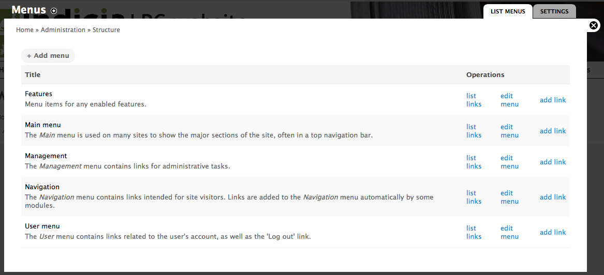
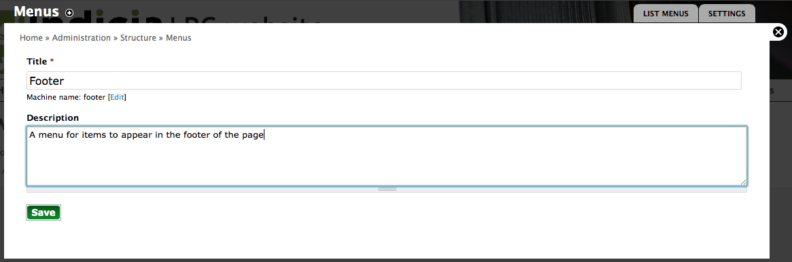
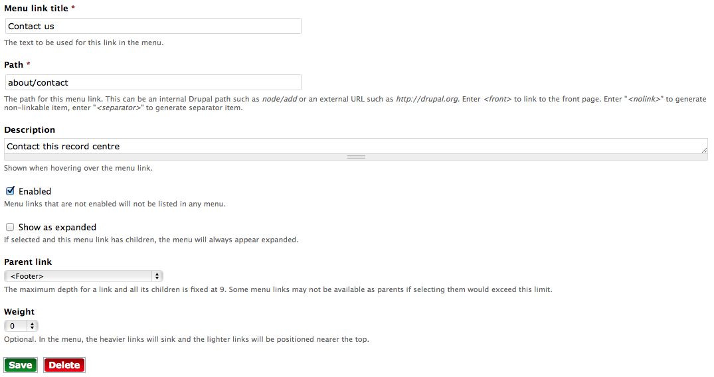

Drupal Menus
============

We've already encountered the Drupal menu system a couple of times so far in this 
documentation. Let's take a look in more detail and pick up a few tips on the way. 

Drupal's menus each consist of a hierarchy of links to various pages on the site. There
can be any number of menus in a Drupal site and you have already seen the **main menu**
and **user menu** running on your template site. Menu's can be rendered onto the page 
as a pretty simple HTML list by Drupal, or you can write code or (more likey) install a module which outputs the 
menu in any way you see fit. Our site already has one such module installed, `Superfish
<https://drupal.org/project/superfish>`_, which converts our simple menu hierarchies into 
nice drop down menus which remain accessible and work well across devices. It's the 
Superfish module which lets the menu drop down when you hover on the **About this record
centre** menu item, for example. We also use another module, `Special menu items 
<https://drupal.org/project/special_menu_items>`_, to allow menu items which don't 
actually link to a page such as the menu headers over each sub-menu. 

To review the menus available on your site, click the **Structure** link in the **admin
toolbar** then click the **Menus** link. This takes you to a page listing the available
menus:

  
There are a few menus here, some created by the Drupal core, some by modules added to our
site. We're only using the **Main menu** and **User menu** on our site at the moment. 
Click the **list links** link by the **Main menu** to view the links for our menu. This 
page shows the complete layout of our menu and provides handy drag-handles so that you 
can re-order menu items and even move them between different menus.

  
Have a practice moving menu items around and remember to click the **Save configuration**
button if you want to save your changes.

Adding a footer menu
--------------------

As Drupal allows any number of different menus, let's create a menu to appear on our page
footer. Return to the page listing the menus (use the site **breadcrumb trail**, or click
**Structure** then **Menus again**). This time, click the **Add menu** button. The menu 
settings popup which appears is pretty simple, so fill it in to describe your menu. There
is no need to worry to much about exactly what you specify here as it is just information
for site administrators and won't be shown to the public. Click the **Save** button when
done.

  
After saving the menu settings, Drupal takes you to the currently empty list of links so
click the **Add Link** button to start populating our menu. Add a link to the existing 
**Contact us** page by filling in the following settings:

* **Menu link title**=Contact us
* **Path**=about/contact
* **Description**=Contact this record centre

Leave the other settings as they are.

  
Save the page. Your footer menu has now been created and has a link in it, but if you
visit your home page you will find that it does not appear anywhere. That's because Drupal
can't make assumptions about where to put things based on the fact that we called it 
"footer", we have to explicitly tell it where to put the menu. Time to learn about another
aspect of Drupal - **blocks**!