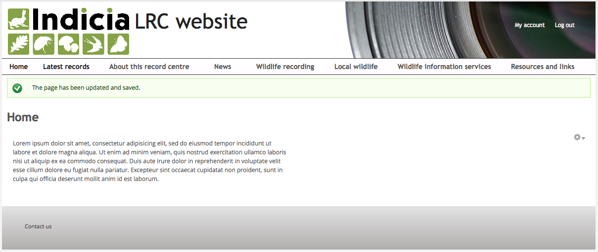
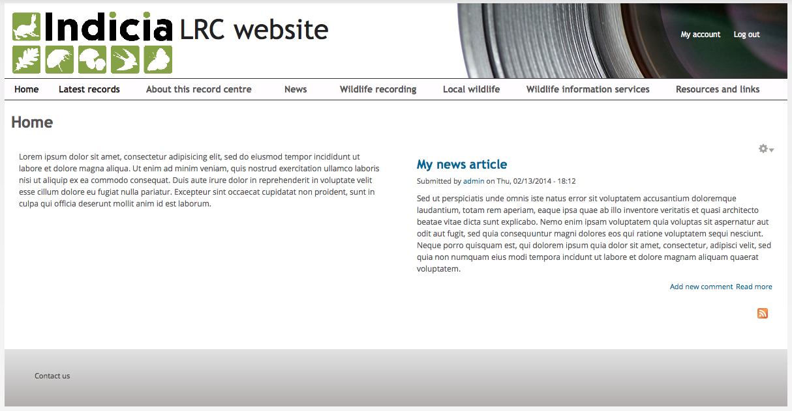

Tutorial - Drupal Panels
========================

In this tutorial we'll learn to use the **Panels** and **Page manager** modules to 
configure a custom home page layout. 

Before you start
----------------

Since we will be inserting the output of **Views** into our custom page layout, before
following this tutorial please select **Modules** from the **admin toolbar** then search
for the **Views content panes** module and tick the checkbox to enable it, then scroll to
the bottom and click the **Save configuration** button. 

Also make sure that you have at least the **Front page** view enabled via the
**Structure** - **Views** page by clicking the **Enable** link to the right of the view in
the list, so that we can add this view to our page. 

.. tip::

  The Views module comes with a set of example views which are disabled by default. One of
  these is the **Front page** view which replicates the functionality of the default home
  page of Drupal. It outputs all content where the **Promote to front page** option is
  checked (under the **Publishing options** section on the **Edit** tab each page). 

#. Click **Structure** in the **admin toolbar** then select the **Pages** link. 
#. Click the **Add custom page** button at the top of the list of pages.
#. Set the **Administrative title** to "home" and the **Administrative description** to
   "Home page layout".
#. Set the **Path** to "home".
#. Tick the **Make this your site home page** checkbox.

   .. figure:: ../images/drupal-panels-step-1.png
     :width: 800px 
     :alt: Setting up the basic properties of a panels page

#. All the other options on this page can be left at their default setting so click the
   **Continue** button when you are ready.
#. On the next page, you need to specify the basic page layout you want. There are several
   categories of layout available and within each category there may be several layouts.
   Since we want to use a 2 column layout, choose the **AT Responsive Panels - 2 column**
   category and the **AT Two Column 50/50** layout. 

   .. figure:: ../images/drupal-panels-step-2.png
     :width: 600px 
     :alt: Choosing the layout of a panels page
     
   .. tip::
     
     The **AT Responsive Panels** categories are all provided as part of the base Drupal
     theme we are using, called `Adaptive Theme 
     <https://drupal.org/project/adaptivetheme>`_. They provide layouts which respond well
     to different devices such as mobile phones and tablets.
#. Click the **Continue** button to go to the next step. On the next **Panel settings**
   page, click **Continue** again as we don't want to change any settings on this page.
#. The next page is the content editor for our page. It shows a wireframe of the panels 
   layout we have chosen and allows you to insert any content you like into each region.
   
   .. figure:: ../images/drupal-panels-step-3.png
     :width: 800px 
     :alt: Panels layout wireframe ready to add content to
     
     Panels layout wireframe ready to add content to.
   
#. In the region called **Left**, click the cog icon on the left and select **Add 
   content** from the popup menu.
#. A dialog will appear allowing you to first choose, then configure, the type of content
   to add the page. Select **New custom content**.
#. In the following configuration page, set the **Administrative title** to 
   "Introduction" and enter some introductory/welcome text in the **Body** box:
   
   .. figure:: ../images/drupal-panels-text-content.png
     :width: 800px 
     :alt: Adding a custom text content pane
     
     Adding a custom text content pane.
     
   Save the content when you are done by clicking the **Finish** button to return to the 
   view of the panels layout wireframe.
#. In the **Right** region, click the cog icon then select **Add content** as you did
   before. This time, select **Views** from the list of categories of content then select
   the **Front page** view. 
#. Views can be configured with different display variants, for example a single view 
   could output a set of columns when shown in a page, but output a limited set of 
   columns when shown in a block. For this example, on the next step just leave the 
   default option, which is the **Display** is set to **Master** and click **Continue**.
#. On the next page, click the **Override title** checkbox to allow us to take control of
   the title displayed for this content in the panel layout and enter "Recent stories"
   into the associated box. Click **Finish** when done. 
#. Back on the panels layout wireframe, click the **Finish** button, then click **Update
   and save** to save the new panels page. Click the **home icon** in the top left of the
   **admin toolbar** to take you to the home page if you are not already there, so you 
   can check the output. 

If you've followed the tutorial to the letter, you will end up with a home page along the
lines of the following:

  
  The home page panel layout with left column output.
  
Notice that our **Front page** view is not outputting any content at the moment. This is
because the view is configured to only output content that has been **promoted to front
page** and we have none. To get around this, click the **add content** link near the top left
of the page, then choose **Article** which by default will be promoted to the front page.
Set a suitable title and body text for your article then save the content and return to the
home page to check that it appears.

  
  The home page panel layout with left  and right column output.
  
This has just been a quick introduction to panels. Panels can output all types of content
including:

* The output of other existing content pages.
* Lists of content generated by views.
* Custom text content.
* Custom PHP scripts, including code which interacts with the Indicia API.
* The output of modules which declare blocks, e.g. `Weather 
  <https://drupal.org/project/weather>`_ or 
  `Twitter Block <https://drupal.org/project/twitter_block>`_.
  
As usual with anything Drupal, there is *lots* of further reading available on the 
internet. Try the `drupalize.me article 
<http://drupalize.me/series/building-websites-drupal-7-using-panels>`_ if you want to take 
this further.