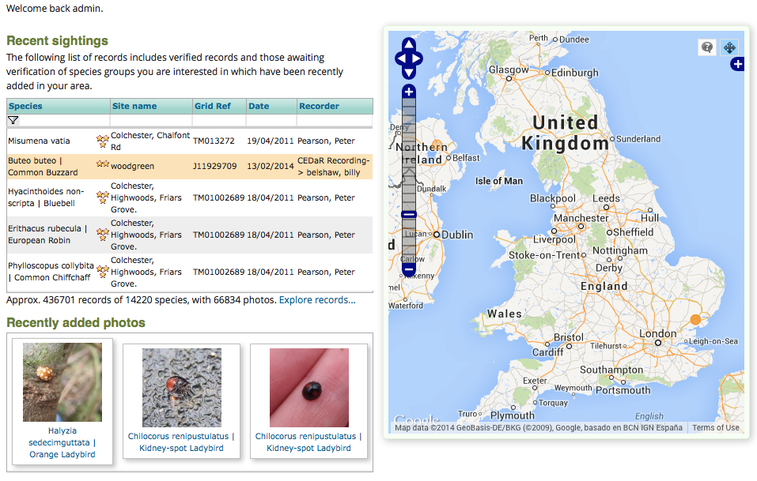

Drupal Panels
=============

Another workhorse of the Drupal modules library is `Panels 
<https://drupal.org/project/panels>`_. Like `Views <https://drupal.org/project/views>`_
Panels is a module I tend to install on most Drupal sites. We have already seen how the
layout of a page can be controlled via a combination of your theme and :doc:`blocks`, but
this approach works well when the blocks are mostly consistent across the site or section
of the site. So, for example the blocks approach is good for setting up a site where the
left column always contains a navigation menu, and the footer area always contains a 
consisten set of links. But what about the scenario where you want to layout the content
area of the page and perhaps to do this differently on several pages? Your home page
might need to contain an area with links to blog posts, an area with links to recent
photos and perhaps an area with the block output created by a weather forecast module. 
Another page might need to show a user's notifications in one column and a second column
containing their direct messages. Although it is possible to use the theming system to create different page 
templates for each page and to use the blocks system to populate the templates, this 
approach has 2 major problems:

* Writing page templates requires you to write PHP & HTML template files to upload to the
  server.
* Drupal's method of configuring blocks to be shown only on certain pages is designed to
  only cope with a small amount of variability between pages. Using this technique to make
  every page different would simply be a nightmare to manage.
  
This is where **Panels** steps in. When combined with the `Page Manager 
<https://drupal.org/node/1862908>`_ module, you can take greater control over the user
experience of your website, including:

* Create totally custom one-off pages with their own mashup of content
* Create page layouts that will be applied when the current page is a certain content
  type. For example, you could create a "Species Account" content type with it's own set
  of fields and corresponding **Panels** layout.
  

The `iRecord <http://www.brc.ac.uk/irecord>`_ home page is an example of a panel layout.

