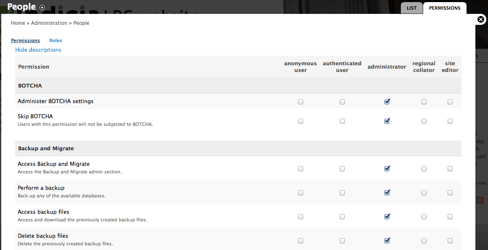
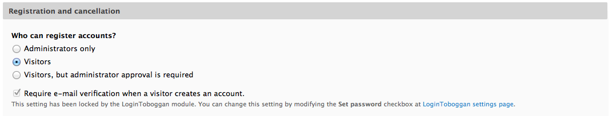

Drupal Users and Permissions
============================

Principles
----------

We are using the Drupal login and permissions mechanisms to control access to all the 
features provided including the Indicia online recording pages. 

Drupal permissions are controlled by role membership, so site users belong to **roles**
and roles define the **permissions** they have. Roles might include things like 
"administrator" and "data manager", a bit like a job title. One person can have multiple
roles so you could be a "data manager" and a "photo moderator" for example.
Visitors to your site can either be logged
out or logged in. Each permissions defines one or several tasks that can be performed, for
example there are permissions such as "Perform a backup". When Drupal decides whether to 
show you the perform backup functionality, it checks if one of your roles has permission 
to do this and the appropriate links, menu items or buttons are only shown if so. This 
behaviour runs throughout Drupal; there are permissions for everything from administering
users through to the ability to view content.

Logged out, anonymous users automatically belong to a **fixed role** called **anonymous
user** and logged in users belong to a **fixed role** called **authenticated user**. These
roles cannot be changed, but you can configure the permissions that are available for
these roles so for example, you might configure Drupal so anonymous users cannot even see
any content - you have to log in before doing anything. You could even configure Drupal 
so that anonymous users can administer the site, obviously not a good idea but perfectly
possible. 

Configuring permissions
-----------------------

You can add roles to the Drupal site yourself. Obviously you must have sufficient
permissions to do this, such as when logged in with the site's admin account. An example
might be to setup a **site editor** role for people who have access to edit site content
without having full admin permissions. We'll work through how to set this up to illustrate
all the concepts you need to understand relating to Drupal permissions. 

#. Select **People** from the **admin toolbar**, then click the **Permissions** tab in the 
   top right of the page. Click on the **roles** link near the top left of the page to 
   access the list of roles. 
   
   .. figure:: ../images/drupal-panels-home-2.png
     :width: 800px 
     :alt: The list of roles
     
     The list of roles

#. Type "site editor" into the **Add role** box at the bottom of the list, then click the
   button to add the role.
#. Click the **edit permissions** link to the right of the role you just added. You will 
   now be looking at a page allowing you to tick each of the permissions you want to allow
   for the role, organised in a list of permissions by module. Tick the following 
   permissions for our site editor role under the **Node** module:
   
   * *Article:* Create new content
   * *Article:* Edit own content
   * *Article:* Edit any content
   * *Article:* Delete own content
   * *Article:* Delete any content
   * *Basic page:* Create new content
   * *Basic page:* Edit own content
   * *Basic page:* Edit any content
   * *Basic page:* Delete own content
   * *Basic page:* Delete any content

#. Scroll to the bottom then click the **Save permissions** button. 

.. tip::

  If you wanted the **site editor** role to also be able to configure the online recording
  pages, reports and maps you would also tick the permissions starting with *Indicia 
  pages* in the page title. 

Adding a user to a role is simply a matter of editing their user account (as long as you 
have the correct permissions to do this of course). Select **People** from the **admin
toolbar** then find the appropriate user and click the edit link. This includes various 
settings for the user account; the one we want to focus on at the moment is the list of 
roles that the user belongs to. Note that the user can of course belong to several roles – 
they could be a site editor and a record verifier at the same time for example.

.. note::

  A challenge for you. See if you can add a new user to the list of users then configure
  them as a site editor, log out and log in as the new user to test the functionality.

When configuring permissions, you can view or edit all the roles and permissions in one
big grid by selecting **People** from the **admin toolbar** then clicking on the 
**Permissions** tab in the top right. 

Indicia permissions specifics
-----------------------------

The Drupal LRC Website template is provided with a number of pages powered by the Indicia
toolkit, under the **Wildlife recording** item on the main menu. Indicia allows you to 
easily control permissions on a page by page basis. By default, the **Submit a sighting**
page is accessible to members of the public, whereas all the other online recording 
and reporting pages are only available to logged in users. There is an **All records**
page which allows users to browse through each other's records. To illustrate how 
to control permissions on a per-Indicia page basis, let's make this page only available
to our **site editor** group. Ensure that you are logged in as admin first.

#. Access the **Wildlife recording** menu's **All records** page.
#. Click the **Edit** link to access the page's configuration.
#. Scroll down to the **Other IForm Parameters** section and tick the **View access
   control** box. This means you want to control the permissions for this page separately
   to the default settings for Indicia forms.
#. In the **Permission name for view access control** box, enter "view all records". 
   This will create a new permission that we must then link to the appropriate role(s).
   
   .. image:: ../images/iform-view-access-control.png
     :width: 800px 
     :alt: Setting view access permissions for an Indicia page
     
#. Scroll to the bottom of the configuration form and save it.
#. Since you are logged in as admin, you can see the form still even though you we haven't
   linked one of your roles to the new "view all records" permission. This is because the
   admin account on a Drupal site is a special account which implicitly has all 
   permissions.
#. Now, go to **People** in the **admin toolbar** then select the **Permissions** tab in 
   the top right of the page. 
#. Search on this page for the **Indicia form module**'s "view all records" permission. 

   .. image:: ../images/drupal-setting-role-permission.png
     :width: 800px 
     :alt: Setting site editor's access to view all records
     
#. Now, scroll to the bottom of the page and save the permissions.

At this point, you may well want to test the permissions out. You'll need to create a 
couple of user accounts to do this, or if you already have existing users on your website
a really handy tool for testing the results of a permissions change from their point of
view is `Masquerade <https://drupal.org/project/masquerade>`_. Since this module has 
already been installed on your site for you, you simply need to access someone's user
account when logged in as admin and you will find a link there to masquerade as that user,
so you can use the Drupal site from within their login to check it works as expected.
Having rights to masquerade is obviously something you'd only want administrators to do!

Controlling the user registration process
-----------------------------------------

A final note whilst we are on the topic of user management. Although the LRC Drupal 
Template website comes pre-installed with a module called `BOTCHA Spam Prevention 
<https://drupal.org/project/botcha>`_, you might still find the occasional spambot user 
will manage to register on the site. Although spambots rarely manage to submit a valid
biological record you might find this is a hassle if you have, for example, added a forum
to your website. Therefore you need to think about whether to allow users to register 
themselves on your website.

If you click on **Configuration** in the **admin toolbar**, then click on the **Account
settings** link in the **People** section, you get to a page allowing various 
configurations relating to the user account to be set. Under the **Registration and 
cancellation** section, you can change the account registration so that:

* an administrator must manually register all users (good for websites with a small group 
  of known users, since spambots cannot register)
* visitors can register
* visitors can register by email verification is required
* visitors can register but admin approval is required.

Have a think about which is most appropriate for the usage of your site.