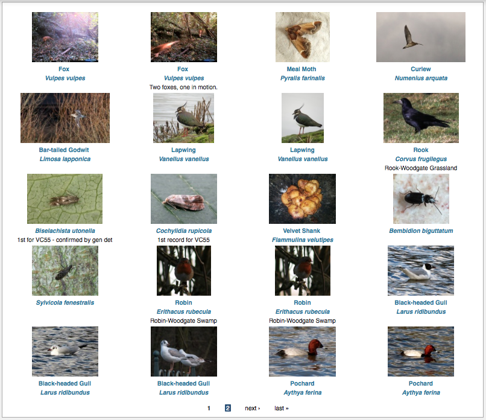

Drupal Views
============

Drupal's `Views module <https://drupal.org/project/views>`_ is considered a "must have"
module, one of those modules which you end up installing on nearly every Drupal site. In 
fact, this is so much the case that Views has now been integrated into core Drupal for the
upcoming Drupal 8 release. So, what's all the fuss about?

Views is a Swiss Army Knife for building outputs which include a list of items. These
lists of items might be:

* a list of content items such as news articles on your home page
* a page listing recent blog posts
* a list of users 
* a gallery of photo content items
* a calendar of diary events
* a list of forum sections or forum posts

Think of Views as a custom report builder, though note that Views works against Drupal
content not Indicia wildlife records - we have different methods for reporting on records. 

  
  The Latest Images page from NatureSpot is a good example of a Drupal View.
  
Since views are such a powerful aspect of Drupal, please take the time to read through
the thorough documentation on `Drupal Garden 
<http://www.drupalgardens.com/documentation/views>`_ and ensure you run through the
`views tutorials <http://www.drupalgardens.com/documentation/views/tutorial>`_ on that 
site.

