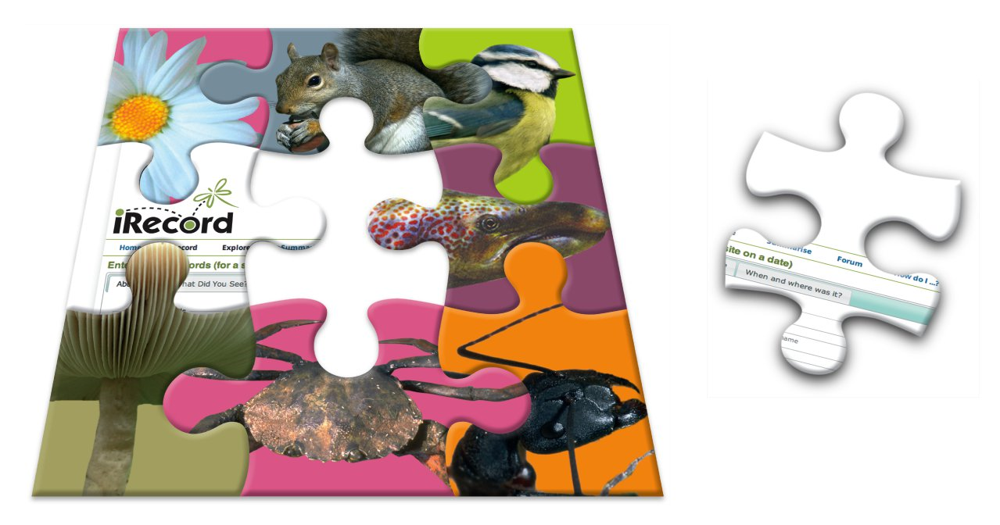

*********************************
LRC Drupal Template Documentation
*********************************

The LRC Drupal Template provides a starting point for building a local environmental
record centre website which features a standard menu structure for you to add content
to, online recording and reporting of wildlife records and simple functionality for 
supporting local recording groups. Wildlife recording functions are provided by 
integration with the `Indicia toolkit <https://code.google.com/p/indicia/>`_.

.. image:: images/drupal-logo.png
     :width: 175px 
     :alt: Drupal logo
     

This guide introduces the basic skills you will need to manage and build upon your new
website. It contains tutorials which are designed to be run through in a development or
testing environment but the principles can then be applied when you configure your live
environment.

.. toctree::
  :maxdepth: 2

  install/index
  drupal/index
  indicia/index
  further-reading
  

