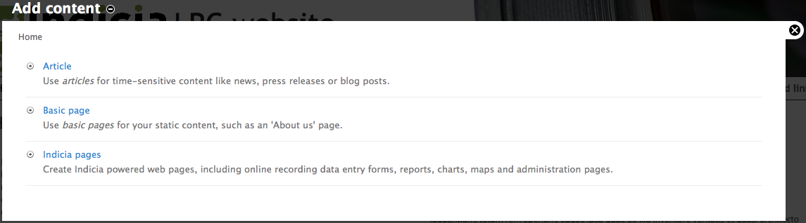
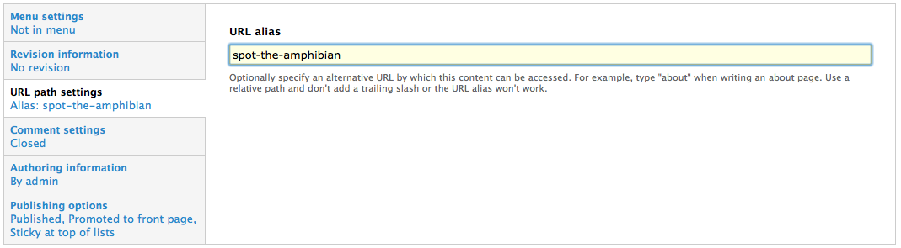
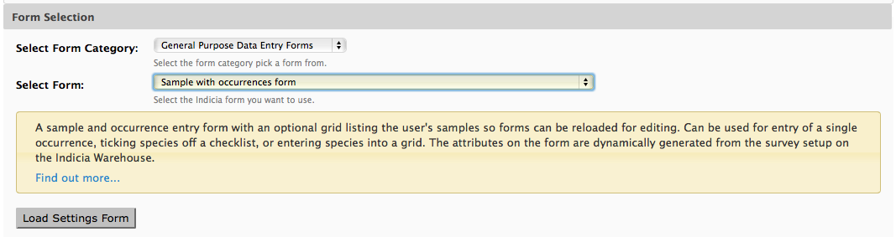
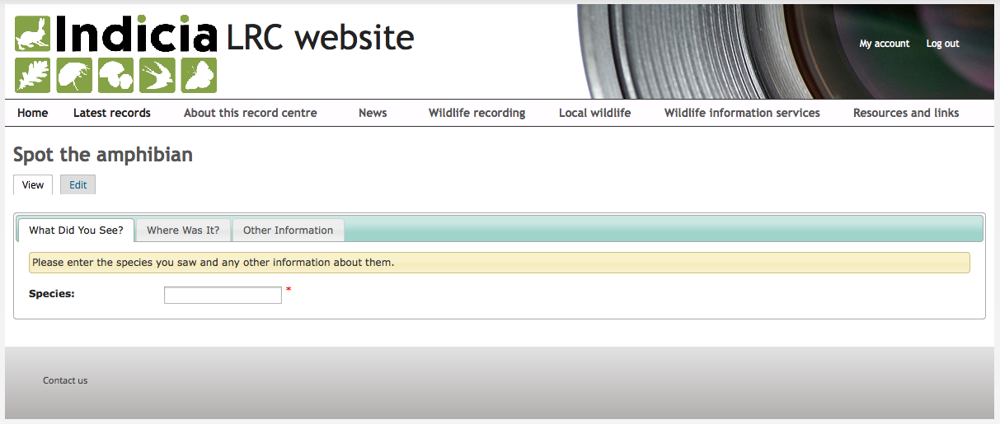
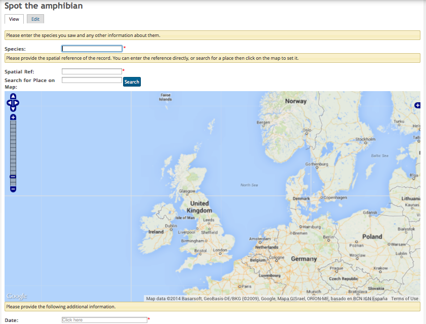
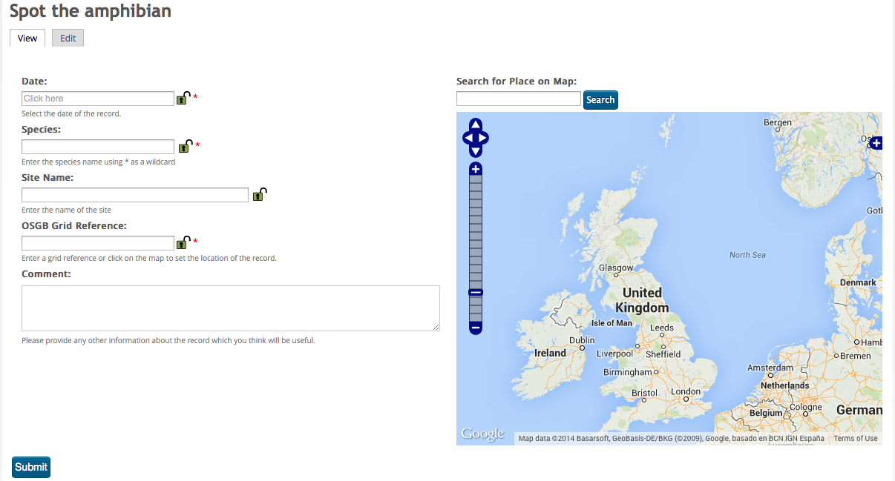

Setting up our recording form on Drupal
=======================================

Now that the survey dataset is ready to accept records on the warehouse, let's add a 
recording form to our website. Back in your Drupal site, select the **Add content** link
which should be in the **shortcuts area** near the top left of the page. Select to add an
**Indicia page**. 

  
You will now be presented with the edit page allowing you to add new content to Drupal.
It has exactly the same options as you've seen early for other Drupal content types such
as **Basic page** - a title, body, publishing options, comment options etc. But, there
is a little more to it which we will find out shortly. Set the title for your page to
"Spot the amphibian". Near the bottom of the page, click on the **Publishing options**
section and check the **Promoted to front page** and **Sticky at the top of lists** since
we want this form to be promoted via the front page rather than hidden in the menus. Also
click on **URL path settings** and set the **URL alias** to "spot-the-amphibian" so that
the URL is nice and memorable.

  
So far everything we've done on this page has been standard Drupal configuration but we
are about to dive into setting up the Indicia aspects of the form. In the **Form
selection** box you can pick from a large library of ready made Indicia powered pages
called **prebuilt forms**. Each form has a set of configuration parameters which allow
them to be set up to your exact needs, so one form might be usable in many different
situations. Prebuilt forms are organised into categories. Select "General Purpose Data
Entry Forms" in the **Select Form Category** control. In the **Select Form** control,
choose "Sample with occurrences form". This is a really flexible Indicia powered page
which can be configured to support a wide range of survey datasets and is the best
choice generally as a starting point for building your survey forms.

Now, click the **Load Settings Form** button. This requests the configuration parameters
from the server and in a moment or two, injects the configuration form into the Drupal 
edit page.

Now, before you panic, there are a *huge* number of configuration settings for this 
particular prebuilt form, but many can be left in their default state so the actual number
you need to understand is quite low. Also, each individual parameter is often quite simple
when viewed in isolation and is accompanied by help text which explains how it works. Here
are a list of the relevant settings you need to configure for our survey:

* **Other IForm Parameters - View access control** can be left unticked in this case to 
  allow the form to be used by the public.
* **Other IForm Parameters - Survey** should be set to **Spot the amphibian**.
* **Base Map Layers - Preset Base Layers** - tick "Google Streets" and "Google Satellite".
* **Species - Allow a single ad-hoc record or a list of records** should be set to "Only
  allow entry of one occurrence at a time".
* **Species - Species List** should be set to **UK Master List** which is the complete 
  of species names provided by UKSI. You may need to pick a different species list to 
  record against if you are on a development server with a different setup.
* **Species - Cache lookups** should be ticked as this allows for better performance when 
  looking up species names, as well as tolerance of things like differences in hyphenation 
  or spacing.
* **Species - Occurrence Images** should be ticked to allow photo upload.
* **Species - Field used to filter taxa** can be set to "Taxon group title". This allows
  us to filter the species returned from the entire dictionary by taxon group (i.e. the
  NBN taxon reporting category).
* **Species - Taxon filter items** should be set to "amphibian".

Now scroll to the bottom and click the **Save page** button. You should have a slightly
untidy but working form:

Although it should be functional, having three different tabs to navigate through for such
a simple form is somewhat overkill. To fix this, click the **Edit** button then scroll 
down to find the **User Interface** section. Change the **Interface Style Option** from 
"Tabs" to "All One Page" then save the form again.  This time we have rationalised the 
form onto a single page, but the form is still rather untidy and the map is very 
dominant:

Click the **Edit** button again and find the **Initial Map View** section. Change the
**Map Height (px)** control to "450". Before you save the page, scroll down to the **User
Interface** section and find the **Form Structure** control. 

.. tip::

  The **Form Structure** configuration allows you to control exactly what controls are
  output onto the page and to take fine control over the configuration parameters passed
  to each control. Its well worth taking the time at some point to follow the `Advanced
  Configuration using the Form Structure 
  <http://indicia-docs.readthedocs.org/en/latest/site-building/instant-indicia/example-setups/irecord-walkthrough/form-structure.html>`_
  tutorial from the `Indicia documentation website 
  <http://indicia-docs.readthedocs.org/en/latest/index.html>`_.

Copy and paste the following configuration settings into the **Form Structure**, 
replacing the existing content, to reformat the layout of the form::

  =Misc=
  [date]
  @class=control-width-4
  @helpText=Select the date of the record.
  @lockable=true
  [species]
  @lockable=true
  @class=control-width-4
  @helpText=Enter the species name using * as a wildcard
  @resizeWidth=1500
  @resizeHeight=1500
  [species attributes]
  [location name]
  @helpText=Enter the name of the site
  [spatial reference]
  @label=OSGB Grid Reference
  @helpText=Enter a grid reference or click on the map to set the location of the record.
  [sample comment]
  @label=Comment
  @helpText=Please provide any other information about the record which you think will be useful.
  [*]
  |
  [place search]
  [map]
  =*=
  

That's better! 