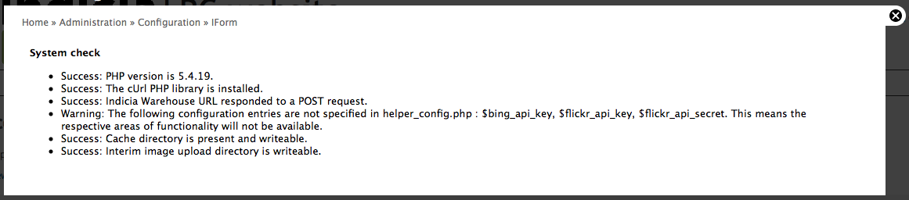

Post installation steps
=======================

Although everything is now installed and in place, there are a few more configuration 
steps required to get your site up and running.

Configure the Drupal file system
--------------------------------

Since the site has been restored from a different environment, Drupal might attempt to 
save temporary files into the wrong location. To fix this:

#. Select **Configuration** from the **admin toolbar** then select **File system** in the
   **Media** section on the left.
#. Clear the **Temporary directory** box then click the **Save** button. This lets Drupal
   work out the best path for temporary files in your environment.

Initialise the theme
--------------------

The LRC Drupal Template is provided with a custom theme which defines the appearance of
the entire site. This theme is highly configurable, so you can change everything from the 
banner to the fonts to the colour schemes. Although we'll learn about configuring the theme
later, an important step in the installation process is to let the theme write out it's
stylesheet and other files according to the current configuration settings. Don't worry 
too much about the details of this yet, just follow these steps:

#. Click on the **Appearance** link in the top admin toolbar, then click on the 
   **settings** link for the Indicia default theme: 

  .. image:: ../images/drupal-select-indiciatheme-settings.png
    :width: 800px
  
#. Scroll all the way to the bottom of the page then click **Save Configuration**. This 
   lets all the settings you can configure on this page be compiled into stylesheets and 
   other site template files. 
#. Click the home icon in the top left corner of the page to check that your site is 
   displaying OK.
  
   .. image:: ../images/drupal-home-page-after-install.png
     :width: 800px
     
Clean URLS
----------

Drupal allows the URL your pages are accessed via to be made more readable. For example,
the URL ``http://www.example.com/?q=my-page`` can be rewritten as 
``http://www.example.com/my-page``, making the URLs easier to remember. This setting
requires a compatible configuration of the web server and may not be possible on all 
servers. To enable the setting, click the **Configuration** link in the admin toolbar, 
then click the **Clean URLS** link in the **Search and metadata** section. Your site will
either detect that clean URLs are supported, in which case you can just click the **Enable
Clean URLs** checkbox and click the **Save configuration** button, or if Drupal thinks
that clean URLs are not supported then you will be presented with a **Run the clean URL
test** button. Refer to the `Drupal handbook <http://drupal.org/node/15365>`_ for more
information in this case.

Cron
----

Cron allows Drupal to run background tasks such as search indexing. Refer to the `Drupal
documentation <https://drupal.org/cron>`_ for information on how to set this up.
   
Initialising Indicia
--------------------

The LRC Drupal Template site, like all other Indicia powered websites, needs a website
registration on the appropriate warehouse, in our case the BRC Community Warehouse. This 
provides a **website ID** and **website password** which your website will need in order
to securely communicate with the warehouse's web services. If you don't already have these
details, then please contact BRC. You can find further notes
on this setup task on the `Indicia documentation website 
<http://indicia-docs.readthedocs.org/en/latest/site-building/warehouse/websites.html>`_. 

Now, click on the Configuration link in the admin menu bar at the top of your Drupal site 
and click the **Settings** link in the **IForm** section, then fill in the following 
details:

#. This page has already been configured to point to the BRC Community Warehouse and you
   can leave the **Indicia Warehouse** configuration option. If developing locally or 
   using the **BRC test warehouse** then you can configure the URL to the warehouse here.
#. Set the **Indicia Website ID* to your website registration's **website ID**.
#. Set the **Password** and **Confirm password** prompts to your website registration's
   **website password**. This should be a secure password as it is used to authenticate 
   record submissions from your website to the warehouse as well as all your site’s 
   requests for report data.
#. The **GeoPlanet API Key** is used to access the **Yahoo! GeoPlanet** place searching 
   webservice, a handy addition to your online recording forms allowing people to search 
   for towns and villages near to their sites. Follow the link on the configuration page 
   to access the Yahoo! page where you can register to receive your own key which needs to 
   be pasted into this box. The registration process is free and fairly quick.
#. **Bing API Key** is only required if you plan to use the Bing map layers. Google layers
   no longer require an API Key.
#. **Map Settings** allows you to pan and zoom an example map to show your record centre’s
   locality. This will then be used as a default setting for recording forms and reports.
   There is also a list of map reference systems which you can use to configure the
   default behaviuor of your forms. The default is for British National Grid support only,
   but you might want to tick the box to enable GPS Lat Long coordinates if you feel that
   is appropriate for your site.

.. tip::

  If you shift drag on the map, you can quickly set the bounding box of an area to zoom 
  into.

Save the settings page when you are done. Now, we want to check that the settings are OK.
Click on the **Configuration** link in the admin toolbar at the top, scroll down and find the
**IForm Diagnostics** link and click it. You will note a warning about a few possible API keys
being missing – don’t worry as these are APIs which we are unlikely to use and where the
key can be added to the configuration later if needs be. But, ensure that all the other
checks this page outputs indicate success:

The most likely type of failure you might observe at this point is for either the cache
directory or interim image upload directories to be not writable by the web server. If
this happens then the two folders you need to ensure are writeable are:

* sites/all/modules/iform/client_helpers/cache
* sites/all/modules/iform/client_helpers/upload

If you are not sure how to make these folders writable then it may be best to ask the
adminstrator of your server.

Create your wildlife survey
---------------------------

The **LRC Drupal Template** is provided with wildlife recording forms that capture ad-hoc
sightings as well as lists of records. You must create a **survey** on the warehouse into
which records will be stored. 

.. tip::

  On the warehouse, a survey means a set of observations with a common purpose and 
  methodology. The survey defines the attributes that are available for recording, for 
  example a bat survey might capture information about the roost, whereas a plant survey
  might capture a DAFOR abundance. In our case, we'll start out with a casual survey for
  ad-hoc sightings, but will learn how to setup other surveys later.
  
As part of the initial setup required to get the **LRC Drupal Template** site up and
running, you will need to ask someone with access to the warehouse database to clone the
template survey for you. The survey must be created first using the warehouse user
interface. Setting up the survey's structure can be done with the following database query
which is correct for the live BRC Community Warehouse, replacing *n* with the ID of the
survey you created:

.. code-block:: sql

  select indicia.f_clone_survey(185, n, 1)
  
Once the survey exists on the warehouse, we need to link the survey to our recording 
forms. From your site's home page, select **Wildlife recording** from the main menu, then
select the **Submit a sighting** link. This will bring you to the submit a single sighting
form, currently incorrectly configured as it needs to be pointed to your survey on the
warehouse. Because you are logged in with admin rights, you can access the page's **Edit**
view from here so click on the **Edit** tab just below the page title. This shows a 
configuration form where you can change a huge number of settings about the online
recording functionality of the current page. Scroll the page down a bit and in the 
**Other IForm Parameters** section, drop down the **Survey** control and choose your 
survey. There should only be one available as this will only show the surveys linked to 
your website registration. Scroll to the bottom and press the **Save** button when you are
done. 

Now, repeat these steps, this time for the **Submit a list of sightings** form. 

